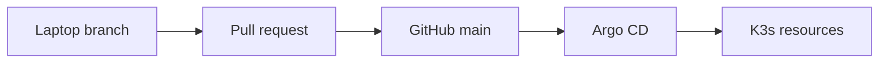

# Homelab architecture

This document captures durable architectural context for maintainers and coding agents. The tracked manifests, scripts, and workflows remain the source of truth when this document and implementation differ.

## Goals and operator constraints

The homelab runs on `krof-desktop`, an operator-described Pop!_OS 24.04 desktop also used for gaming. The design favors low idle overhead, simple recovery, and changes that do not turn the machine into a dedicated server.

The desktop may be powered off intentionally. Private remote access is provided through Tailscale; public port forwarding is not part of the design.

Primary goals are:

1. reliable remote gaming and host access
2. family photo/video storage through Immich
3. useful self-hosted services
4. hands-on Kubernetes, GitOps, CI/CD, IaC, and AI infrastructure learning

The operating-system version, physical-disk topology, laptop administration workflow, and host services such as Tailscale and Sunshine are operator-provided context rather than repository-managed state. Verify them on the live host before a risky operational change.

## Reconciliation and ownership

The repository contains several configuration models with different delivery behavior:

| Area | Recorded configuration | How live state changes |
| --- | --- | --- |
| Kubernetes applications and platform | `kubernetes/` on GitHub `main` | Argo CD reconciles automatically |
| GitHub repository governance | `infrastructure/` | OpenTofu/Terragrunt is planned and applied manually |
| K3s, mounts, and host services | host state plus selected files under `host/` | installed and maintained manually |
| Kubernetes and Restic credentials | names and consumers only | provisioned outside Git |
| Tailnet policy and host Tailscale | not represented | configured outside this repository |

GitHub `main` is therefore the desired-state source for Argo-managed Kubernetes resources and the recorded configuration for manually applied components. A merge does not prove that host, infrastructure, credential, or tailnet state has changed.

## Control plane and GitOps

Kubernetes is a single-node K3s cluster installed directly on the desktop.

Argo CD is installed from `kubernetes/bootstrap/argocd/` and manages the cluster through the app-of-apps definitions in `kubernetes/clusters/krof-desktop/`. Argo CD itself is represented declaratively after bootstrap.

The normal Kubernetes delivery path is:

Application and platform changes should normally enter the cluster through this path. Direct cluster changes are reserved for bootstrap, diagnostics, recovery, and explicitly documented exceptions.

K3s installation, the first Argo CD apply, and seeding the `cluster-root` Application are manual bootstrap boundaries. The repository does not currently automate them.

Relevant repository areas include:

| Path | Purpose |
| --- | --- |
| `kubernetes/bootstrap/argocd/` | pinned Argo CD installation resources |
| `kubernetes/clusters/krof-desktop/` | cluster root and child Argo CD Applications |
| `kubernetes/apps/` | application manifests such as Immich and whoami |
| `kubernetes/platform/traefik/` | K3s Traefik configuration |
| `host/krof-desktop/backup/immich/` | host-level Immich backup assets |
| `infrastructure/` | OpenTofu/Terragrunt GitHub repository governance |
| `scripts/` | repository validation helpers |

## Deployment contract

The declared configuration assumes that an operator has already provided:

- a host named `krof-desktop` with K3s, its `local-path` provisioner, and packaged Traefik
- the data and backup filesystems mounted at the paths expected by the manifests and backup script
- the Immich library, PostgreSQL, and database-dump directories with suitable ownership and permissions
- an initialized Restic repository and readable password file
- the required Kubernetes Secrets in their destination namespaces
- network access to GitHub, the Tailscale Helm repository, the remote Argo CD manifest, and validation schema catalogs
- Azure and GitHub authentication when planning or applying repository-governance infrastructure

These prerequisites are not automated here. This is a dependency boundary, not a tested cold-start runbook. During bootstrap or recovery, verify live storage and credentials before allowing the root Application to reconcile dependent workloads.

## Networking and ingress

Tailscale is the intended private network boundary for remote application access.

The Tailscale Kubernetes Operator is deployed as an Argo CD Application from the official Tailscale Helm repository. Tailscale-managed Ingress resources expose `whoami` and the Immich server through private HTTPS endpoints.

Traefik remains installed as part of K3s but its Service is configured as `ClusterIP`. The previous Traefik NodePort fallback was temporary and has been removed.

The earlier K3s ServiceLB path did not preserve the remote client source address needed by Traefik's Tailscale-CIDR middleware. A temporary NodePort with local external traffic policy preserved that address. Tailscale Ingress replaced the workaround and removed the fixed node ports.

The repository configures the operator and requests Tailscale Ingress, but it does not manage tailnet ACLs or grants, tag ownership, DNS or certificate policy, OAuth provisioning, or the host Tailscale agent. Private reachability and authorization depend on those external controls as well as these manifests.

## Storage

Immich primary data is intentionally stored outside K3s' default local-path area on the dedicated data mount.

The cluster defines a static `immich-local-retain` StorageClass and retained local PersistentVolumes for:

- the Immich library under `/mnt/data-drive-2tb/homelab/immich/library`
- PostgreSQL data under `/mnt/data-drive-2tb/homelab/immich/postgres`

The volumes have node affinity for `krof-desktop`, require the host directories to exist, and cannot fail over to another node without a storage migration. Their capacity values describe Kubernetes bindings; they do not create filesystem quotas.

The StorageClass, PVs, and retained PVCs use `Retain`, `Prune=false`, and `Delete=false` protections. These reduce accidental deletion risk but are not backups.

The protected storage resources are managed by the separate `immich-storage` Argo CD Application, while the PVCs and workloads are managed by `immich`. There are no explicit sync waves between those child Applications, so bootstrap and recovery must verify that the static PVs and PVCs are ready before relying on Immich.

The machine-learning model cache uses regular K3s local-path storage because it is reproducible cache data rather than primary family data.

## Immich

Immich is deployed from `kubernetes/apps/immich/` and currently consists of:

- Immich server
- PostgreSQL
- Valkey
- Immich machine learning
- retained library and PostgreSQL PVCs
- a local-path machine-learning cache PVC
- a Tailscale Ingress

Container versions, probes, and resource requests and limits are defined in the manifests; inspect the current files rather than copying versions from documentation.

The server and PostgreSQL both consume the manually provisioned `immich-database` Kubernetes Secret.

## Backups and recovery

Immich backups are host-level rather than Kubernetes workloads. The repository stores the script and systemd units, but it does not install them into `/usr/local/sbin` and systemd or enable the timer automatically.

The timer is scheduled daily at 03:00 local host time and is persistent. If the desktop is off at that time, systemd can start the missed job after the next boot.

The backup process:

1. verifies the data and backup mountpoints, filesystems, and expected device identities
2. waits for the Immich PostgreSQL pod
3. creates and gzip-validates a fresh PostgreSQL dump
4. backs up the library and database-dump directory with Restic
5. keeps 7 daily, 4 weekly, and 6 monthly snapshots and prunes older data
6. runs `restic check`

The Restic repository is stored under `/mnt/backup/homelab/immich/repository`. Its password is a host credential outside Git. The reproducible machine-learning cache is not backed up.

The database dump is consistent when created, but Immich remains available while Restic reads the library. The database dump and media snapshot are therefore not guaranteed to represent one atomic point in time.

`restic check` validates repository structure; it does not prove that the application can be restored. The repository has no tested cold-restore procedure, automated secret recovery, or off-machine backup. Protection from primary-disk failure is conditional on `/mnt/backup` being an independent healthy device. A device inside the same desktop still does not protect against theft, fire, total-machine loss, or every malware and electrical failure scenario.

The host backup is tightly coupled to the Immich namespace, PostgreSQL pod and container names, database name, host paths, K3s binary location, Restic repository, and password file. Kubernetes or host changes to those interfaces must be reviewed together.

## GitHub repository infrastructure

OpenTofu and Terragrunt manage this repository's GitHub settings and main-branch ruleset. The module prevents repository destruction and requires the IaC and Kubernetes status checks configured in the module.

State is stored in an Azure backend and authentication uses operator-provided Azure and GitHub credentials. GitHub Actions formats and validates this configuration but does not plan or apply it. Infrastructure changes require an explicit manual plan and apply against the intended live target.

## Secrets and trust boundaries

The repository is public, so plaintext credentials and sensitive private infrastructure details must never be committed.

Current manually provisioned secrets include:

| Location | Secret | Purpose |
| --- | --- | --- |
| `tailscale` namespace | `operator-oauth` | Tailscale Kubernetes Operator OAuth client |
| `immich` namespace | `immich-database` | Immich and PostgreSQL database password |
| host | Restic password file | unlock the local Restic repository |

Azure backend authentication and GitHub provider credentials are also supplied outside the repository. Names and non-secret key structure may appear in manifests; their values must not.

## Host-level services

Not every service belongs in Kubernetes. Host Tailscale and Sunshine are intended to remain host-level because they provide access to, or depend directly on, the desktop itself. Their installation and live state are not managed by this repository and must be verified on the host.

The Immich backup assets are likewise host-level. A merge changes the recorded files but does not copy, reload, enable, or start their installed systemd counterparts.

## Validation

Pinned local development tools are declared in `mise.toml`. Kubernetes manifests are rendered with `kubectl kustomize` and checked with `kubeconform` by `scripts/validate-kubernetes.sh` and GitHub Actions.

Kubernetes validation does not require access to a live cluster. It does require network access because the Argo CD Kustomization uses a remote pinned manifest and schema validation uses remote catalogs.

The IaC workflow checks formatting, initializes and validates the standalone OpenTofu module without a backend, and validates Terragrunt HCL. It does not authenticate to or compare against live infrastructure.

## Change safety

Important invariants:

- a merge can automatically affect Argo-managed Kubernetes resources, but not manually managed host or infrastructure state
- do not expose applications publicly by default
- do not make retained storage disposable
- do not put credentials, private network identifiers, or personal data in the public repository
- do not assume the desktop is online continuously
- avoid changes that materially harm gaming performance without an explicit reason
- treat backup existence and restore readiness as separate properties
- prefer recoverability before availability complexity
