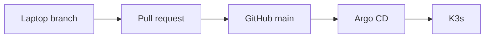

# Homelab architecture

This document captures durable architectural context for maintainers and coding agents. The current manifests and scripts remain the source of truth when this document and implementation differ.

## Goals and constraints

The homelab runs on `krof-desktop`, a Pop!_OS 24.04 desktop that is also used for gaming. The design therefore favors low idle overhead, simple recovery, and changes that do not turn the machine into a dedicated server.

The desktop may be powered off intentionally. Private remote access is provided through Tailscale; public port forwarding is not part of the design.

Primary goals are:

1. reliable remote gaming and host access
2. family photo/video storage through Immich
3. useful self-hosted services
4. hands-on Kubernetes, GitOps, CI/CD, IaC, and AI infrastructure learning

## Control plane and GitOps

Kubernetes is a single-node K3s cluster installed directly on the desktop.

Argo CD is bootstrapped from `kubernetes/bootstrap/argocd/` and manages the cluster through the app-of-apps definitions in `kubernetes/clusters/krof-desktop/`. Argo CD itself is also represented declaratively.

The normal delivery path is:

Application and platform changes should normally enter the cluster through this path. Direct cluster changes are reserved for bootstrap, diagnostics, recovery, and secrets that have not yet been migrated to GitOps.

Relevant repository areas include:

| Path | Purpose |
| --- | --- |
| `kubernetes/bootstrap/argocd/` | Argo CD bootstrap |
| `kubernetes/clusters/krof-desktop/` | Cluster root and child Argo CD Applications |
| `kubernetes/apps/` | Application manifests such as Immich and whoami |
| `kubernetes/platform/traefik/` | K3s Traefik configuration |
| `host/krof-desktop/backup/immich/` | Host-level Immich backup automation |
| `infrastructure/` | OpenTofu/Terragrunt infrastructure and GitHub repository governance |
| `scripts/` | Repository validation helpers |

Pinned development tools are declared in `mise.toml`. Kubernetes manifests are rendered and checked by `scripts/validate-kubernetes.sh` and the GitHub Actions Kubernetes validation workflow.

## Networking and ingress

Tailscale is the private network boundary for remote application access.

The Tailscale Kubernetes Operator is deployed as an Argo CD Application from the official Tailscale Helm repository. Tailscale-managed Ingress resources expose services privately with HTTPS.

Current Tailscale Ingress consumers include:

- `whoami`, used as a small GitOps/networking test workload
- `immich`, exposing the Immich server service privately

Traefik remains installed as part of K3s but its Service is configured as `ClusterIP`. The previous Traefik NodePort fallback was temporary and has been removed.

The reason for the current ingress design is historical but important: the earlier K3s ServiceLB path rewrote the remote client source address before Traefik's Tailscale-CIDR middleware evaluated it. A temporary NodePort with local external traffic policy proved that Tailscale itself was working and preserved the client address. Tailscale Ingress then replaced that workaround and removed the need to expose fixed node ports.

The host Tailscale agent is separate from the Kubernetes operator and remains important for SSH, administration, and host-level remote services.

## Storage

Immich persistent data is intentionally stored outside K3s' default local-path area on the dedicated data mount.

The cluster defines a static `immich-local-retain` StorageClass and retained local PersistentVolumes for:

- the Immich library under `/mnt/data-drive-2tb/homelab/immich/library`
- PostgreSQL data under `/mnt/data-drive-2tb/homelab/immich/postgres`

These resources use retention/prune protections because accidental Git deletion must not delete family media or the database.

The machine-learning model cache uses the regular K3s local-path storage because it is reproducible cache data rather than primary family data.

## Immich

Immich is deployed from `kubernetes/apps/immich/` and currently consists of:

- Immich server
- PostgreSQL
- Valkey
- Immich machine learning
- retained library and PostgreSQL PVCs
- a Tailscale Ingress

Container versions and resource limits are intentionally defined in the manifests; inspect the current files rather than copying versions from documentation.

The server and PostgreSQL both consume the `immich-database` Kubernetes Secret. That Secret is currently bootstrapped outside Git.

## Backups

Immich backups are host-level rather than Kubernetes workloads.

The systemd timer in `host/krof-desktop/backup/immich/` runs daily. The backup process:

1. verifies the data and backup mounts
2. waits for the Immich PostgreSQL pod
3. creates and gzip-validates a fresh PostgreSQL dump
4. backs up the library and database dump with Restic
5. applies daily/weekly/monthly retention
6. runs `restic check`

The Restic repository is stored under `/mnt/backup/homelab/immich/repository`. Its password is a host bootstrap secret outside Git.

Because the backup drive is inside the same desktop, it protects against common logical loss and primary-disk failure but not theft, fire, total-machine loss, or every malware/electrical failure scenario. Off-machine backup remains a future resilience improvement.

## Secrets and trust boundaries

The repository is public, so plaintext credentials must never be committed.

Current manually bootstrapped Kubernetes secrets include:

| Namespace | Secret | Purpose |
| --- | --- | --- |
| `tailscale` | `operator-oauth` | Tailscale Kubernetes Operator OAuth client |
| `immich` | `immich-database` | Immich/PostgreSQL database password |

These names and non-secret key structure may appear in manifests; their values must not.

The next secret-management phase is planned around SOPS with age. The intended model is:

1. keep the age private identity outside Git
2. commit only the public age recipient and SOPS ciphertext
3. let Argo CD sync encrypted resources
4. decrypt inside the destination cluster
5. materialize normal Kubernetes Secrets for applications

This is planned architecture, not current deployed state. The migration should preserve existing application credential values. Credential rotation is a separate task.

## Host-level services

Not every service belongs in Kubernetes. Host Tailscale and Sunshine should remain host-level because they provide access to, or depend directly on, the desktop itself. Other workloads should be evaluated case by case rather than moved to K3s solely for consistency.

## Change safety

Important invariants:

- GitHub `main` is desired state, but live cluster state must still be checked when operational correctness matters.
- Do not expose applications publicly by default.
- Do not make retained storage disposable.
- Do not put secrets or private network identifiers in the public repository.
- Do not assume the desktop is online 24/7.
- Avoid changes that materially harm gaming performance without an explicit reason.
- Prefer backups and recoverability before availability complexity.
